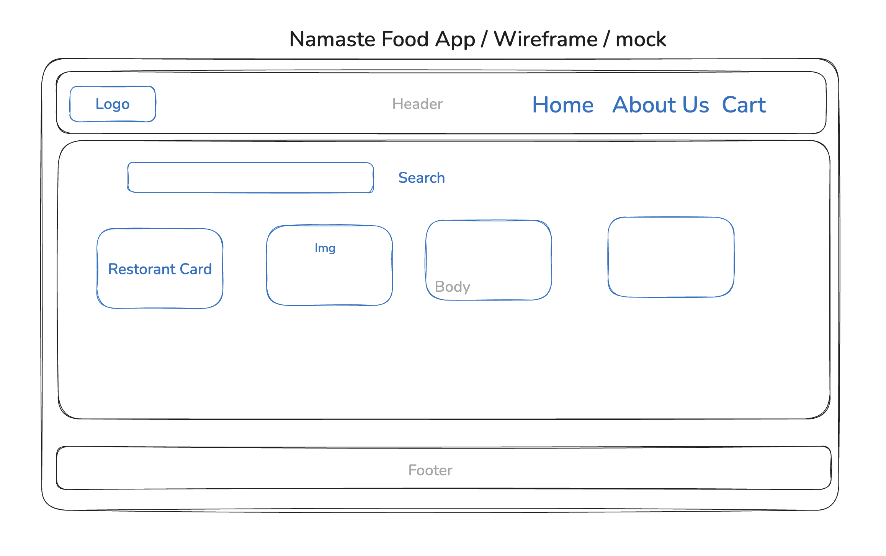

# E4 - Talk is Cheap, Show Me the Code

> In this hands-on episode, we move from theory to practice. You'll write your first React components, gaining practical experience in bringing your ideas to life. It's the moment when you see the magic of React in action.

- [Talk is Cheap, Show Me the Code Notes](https://github.com/pravn27/reactjs-tech-doc/blob/master/docs/reactjs-course-tutorials/namaste-reactjs-course/readerDoc/E4-Show-Me-the-Code/E4-Show-Me-the-Code.pdf)
- [Assignments - Talk is Cheap, Show Me the Code](https://github.com/pravn27/reactjs-tech-doc/blob/master/docs/reactjs-course-tutorials/namaste-reactjs-course/readerDoc/E4-Show-Me-the-Code/Assignments-ShowMeTheCode.pdf)

## Reference links from pdf notes & assignments

- Code Link: https://bitbucket.org/namastedev/namaste-react-live/src/master/
- React without JSX: https://reactjs.org/docs/react-without-jsx.html
- Virtual DOM: https://reactjs.org/docs/faq-internals.html
- Reconciliation: https://reactjs.org/docs/reconciliation.html
- React Fiber Architecture: https://github.com/acdlite/react-fiber-architecture
- React Without ES6: https://reactjs.org/docs/react-without-es6.html
- Index Keys as Anti-Pattern: https://robinpokorny.com/blog/index-as-a-key-is-an-anti-pattern/

## key points

- **Planning** - Before building any real time web apps from scratch, planning is very important about How to build ? What to build ? Why to build ? and how to build it in a better way.
  - Never start blindly writing code without any planning. It's like building a house without any plan. It's not possible.
  - High level planning what to build, kind of prototyping, and then start writing code.
- HLD (High level design of Food App)

  - 

- React Props
- **What is Config driven UI** ?

  - A Config-Driven UI (Configuration-Driven UI) is an approach where the user interface (UI) is not hardcoded but is generated dynamically based on a configuration file. This configuration is usually in JSON or YAML format and defines what elements (buttons, text fields, checkboxes, etc.) should appear on the screen. Instead of writing separate UI code for each screen, we use a generic renderer that reads the config and builds the UI dynamically. Controlling the UI based on configuration files is a very powerful approach and is used by many companies like Swiggy, Uber, etc.
    - Example: Swiggy uses this approach to build their UI. They have a config file for each screen and based on that config file they build the UI. According to end users location, they can change the config file and the UI will change accordingly.

- Why we need react keys in looping list of items?
  - Keys help React identify which items have changed, are added, or are removed. Keys should be given to the elements inside the array to give the elements a stable identity.
  - **Never use index as key in map, not recommended**
  - https://react.dev/learn/rendering-lists
  - https://legacy.reactjs.org/docs/reconciliation.html#recursing-on-children
  - https://robinpokorny.com/blog/index-as-a-key-is-an-anti-pattern/

## Assignments - Q & A

    1.sada

    2.asda
