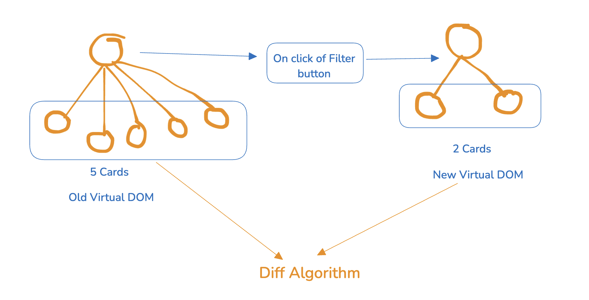
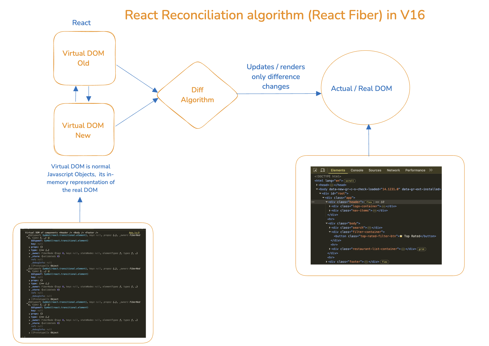

# E5 - Lets Get Hooked

> Hooks are the game-changer in React development, and in this episode, we explore them in depth. You'll discover how to use state and other React features with Hooks, bringing a new level of power and flexibility to your app.

- [Get Hooked Notes](https://github.com/pravn27/reactjs-tech-doc/blob/master/docs/reactjs-course-tutorials/namaste-reactjs-course/readerDoc/E5-Get-Hooked/E5-Get-Hooked.pdf)
- [Assignments - Get Hooked](https://github.com/pravn27/reactjs-tech-doc/blob/master/docs/reactjs-course-tutorials/namaste-reactjs-course/readerDoc/E5-Get-Hooked/Assignments-GetHooked.pdf)

## Reference links from pdf notes & assignments

- React Fiber architecture repository: https://github.com/acdlite/react-fiber-architecture
- Code Link - https://bitbucket.org/namastedev/namaste-react-live/src/master/

## key points

- ReactJS projects file & folder structure
  - https://www.robinwieruch.de/react-folder-structure/
  - https://dev.to/itswillt/folder-structures-in-react-projects-3dp8
  - https://legacy.reactjs.org/docs/faq-structure.html
- Never keep any hardcoded data / mock data inside your react components, keep it separately in a file and import it wherever required
- import & export in react
- Event handlers in react
- React is fast in DOM manipulation because it uses virtual DOM
- ReactJS - (data of application) Data layer & UI layer consistent, works together, properly in sync & render the UI according to Data layer changes in efficient way
- React Hooks are normal JS functions, but they have some special features
- When ever react state variables changes / updates / modify, react will rerenders the component again
- React always keep sync with Data layer & UI layer, so whenever (react states) data changes, react will rerender the component again
- Why react is so fast, because of super fast in DOM operations & renders the UI in very efficient way

- **Virtual DOM**

  - Virtual DOM is representation of actual / real DOM, and its in the form of normal JS Objects (compiled React Elements)
  - In React, the Virtual DOM is a lightweight, in-memory representation of the real DOM that React uses to efficiently update the UI, minimizing unnecessary re-renders and improving performance

  

  - Virtual DOM vs Real DOM in React.js

    - What is the Virtual DOM?
      - The Virtual DOM (V-DOM) is a lightweight JavaScript representation of the Real DOM used in web browsers. It allows React to perform efficient updates to the user interface by first computing what changes are necessary and then updating only those parts of the actual DOM.

  - **How it Works in React**
    1. When a component’s state or props change, React creates a new Virtual DOM tree.
    2. React compares it with the previous Virtual DOM using a "diffing" algorithm.
    3. It calculates the minimum number of operations needed to update the Real DOM.
    4. Only those specific parts of the Real DOM are updated, making the process faster and more efficient.
  - https://www.freecodecamp.org/news/what-is-the-virtual-dom-in-react/
  - https://refine.dev/blog/react-virtual-dom/#ignoring-performance-tools

- **Virtual DOM vs Real DOM**

      | Feature      | Virtual DOM                       | Real DOM                         |
      | ------------ | --------------------------------- | -------------------------------- |
      | Type         | JavaScript Object                 | Browser-provided Document Object |
      | Update Speed | Fast (batch updates)              | Slow (direct manipulation)       |
      | Efficiency   | Efficient diff and patch          | Inefficient full re-rendering    |
      | Re-rendering | Updates only what is necessary    | Re-renders entire sections       |
      | Used By      | React, Vue, and other modern libs | Core of browser rendering        |

  - Summary

    - The Virtual DOM improves performance by minimizing direct manipulation of the Real DOM. React uses it to determine the most efficient way to update the UI without unnecessary re-renders.

- **Reconciliation algorithm** - also known as **React Fiber**

  - React's reconciliation algorithm, also known as the diffing algorithm, efficiently updates the DOM by comparing a new virtual DOM with the previous one, identifying changes, and applying only the necessary updates to the real DOM
  - The React Reconciliation Algorithm is how React efficiently updates the DOM to reflect changes in state or props. At a high level, it compares the previous virtual DOM with the new one, identifies the differences (called "diffing"), and then updates only the changed parts of the real DOM. This process ensures that the UI stays in sync with the data layer, providing a smooth and responsive user experience.
  - The React Reconciliation Algorithm is the process React uses to efficiently update the DOM when the state or props of a component change.
  - Whenever something changes in your React app (like a button click or API response), React needs to figure out what changed in the UI and update only those parts. The process of figuring this out is called reconciliation.
  - **Key observation** - Finding out difference between real DOM html nodes is expensive operation. And finding out difference between 2 virtual DOM / JS Objects is faster / cheap operation.

  - What is Diff Algorithm?

    - Find out differences between two virtual DOM trees which is old vs new virtual DOM tree.
    - The diffing algorithm is a core part of React's virtual DOM. It compares the previous virtual DOM tree with the new one and identifies the differences between them. The algorithm then updates only the parts of the real DOM that have changed, rather than re-rendering the entire tree. This process is known as reconciliation and helps improve the performance of React applications.

    

    ***

    

  - https://legacy.reactjs.org/docs/reconciliation.html
  - https://github.com/acdlite/react-fiber-architecture

## Assignments - Q & A

    1.sada

    2.asda
