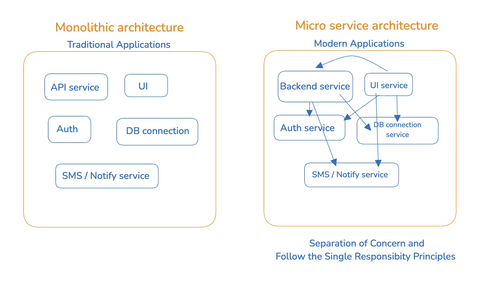

# E6 - Explore the World

> Navigation is essential, and in this episode, we delve into React routing. You'll learn how to navigate seamlessly within your app, creating a smooth and user-friendly experience.

- [Explore the World Notes](https://github.com/pravn27/reactjs-tech-doc/blob/master/docs/reactjs-course-tutorials/namaste-reactjs-course/readerDoc/E6-Explore-the-World/E6-Explore-the-World.pdf)
- [Assignments - Explore the World](https://github.com/pravn27/reactjs-tech-doc/blob/master/docs/reactjs-course-tutorials/namaste-reactjs-course/readerDoc/E6-Explore-the-World/Assignments-ExploreWorld.pdf)

## Reference links from pdf notes & assignments

- test
- test

## key points

- **Monolithic architecture vs Microservices architecture**

  - **Monolithic architecture**: A single, unified application that contains all the necessary components and services. It is easier to develop and maintain, but can become difficult to scale and update.
    Example: A single web application that handles all the functionality, such as UI layers, user authentication, Backend services, data storage, and API calls, DB connections, Email Services, etc.
  - **Microservices architecture**: A distributed system that consists of multiple smaller, independent services that work together to provide a complete application. Each service is responsible for a specific functionality and can be developed, deployed, and scaled independently.
    Example: A web application that consists of multiple microservices, such as a user authentication service, a data storage service, and an API service.

    - How do they talk / communicate each of the micro services? Lets say UI wants talk with Backend services, auth services, data storage services, etc.
      - REST APIs
      - GraphQL
      - gRPC
      - Message Queue
      - Event Bus
      - etc.

    

---

    

- useEffect react hook
- CORS policy security features
  - How to bypass CORS policy from localhost ? use CORS browser extension
- **What are the best way of UX while requesting API services ?**
  - **(Latest) Recommend to use for better UX - Shimmer UI / Fake UI / Skeleton loader**
  - Not recommended - use Loader text / loader images / loading indicator
- **Whenever state updated, whole component will rerender again**
  - **Whenever state variables updates, react triggers a Reconciliation cycle (rerender the component)**
- React is very very efficient in DOM manipulation with Reconciliation cycle

## Assignments - Q & A

    1.sada

    2.asda
