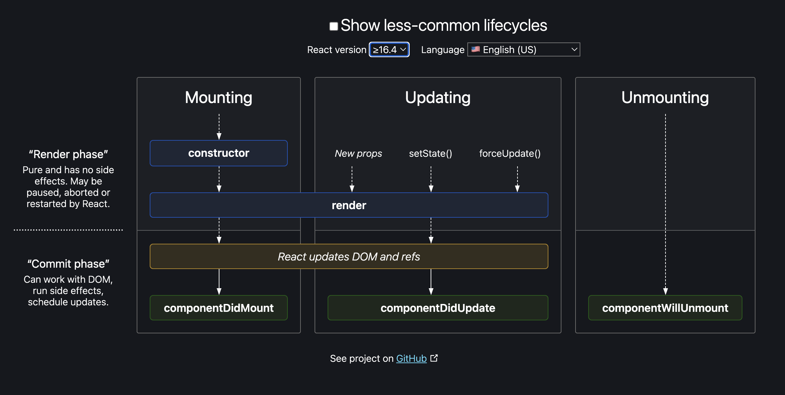
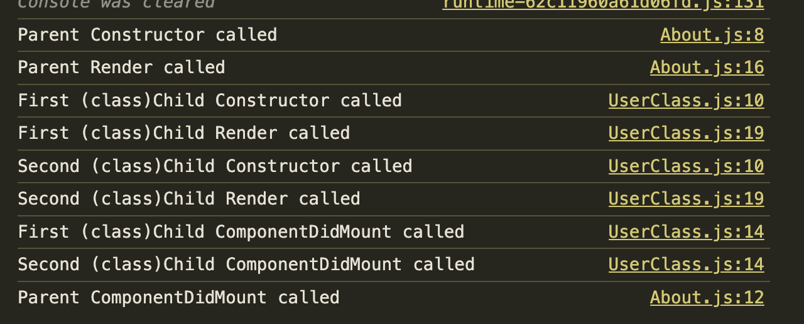

# E7 - Let's Get Classy

> In this episode, we introduce class components, expanding your React toolkit. You'll discover a different approach to creating components and how class components complement your React development skills.

- [Lets Get Classy Notes](https://github.com/pravn27/reactjs-tech-doc/blob/master/docs/reactjs-course-tutorials/namaste-reactjs-course/readerDoc/E8-Get-Classy/E8-lets-get-classy.pdf)
- [Assignments - Lets Get Classy](https://github.com/pravn27/reactjs-tech-doc/blob/master/docs/reactjs-course-tutorials/namaste-reactjs-course/readerDoc/E8-Get-Classy/Assignments-LetsGetClassy.pdf)

## Reference links from pdf notes & assignments

- test
- test

## key points

- What is Class based components ?
  - Its Normal javascript class, which has render() method which returns JSX
  - Why do we use super(props) in class based components inside constructor ?
- Loading class based components into web page means, creating instance of the class, whenever instance of the class created, constructor method will call, so better to create state inside constructor
- Life cycle of react class based component
- Loading the component means mounting the component into web page
- While calling any API, why do we use it inside componentDidMount() ?
  - Better UX experience
  - First quickly render / mount the component into web page, then request for API calls & get the data & re render with API response data
- React Lifecycle methods - https://projects.wojtekmaj.pl/react-lifecycle-methods-diagram/

  

  - 2 major phases
    - Render phase
    - Commit phase

- For react performance optimization, once render phase done for all child components, it will batch together & similarly for commit phase also for all child components commit phase will batch together
- Lets say Parent component has 2 child component, how react life cycle methods will run, follow the order, all the child components render phase & commit phase will batch together for react performance optimization

  

## Assignments - Q & A

    1.sada

    2.asda

---

- **Stopped at 1hr 43min**
